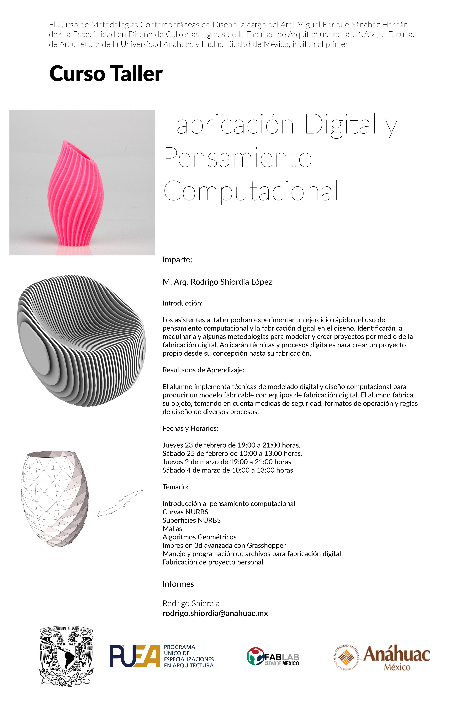

# Workshop PUEA EDCL 2023

## Acerca de...
* [Video Workshop PUEA 2023](https://redanahuac.zoom.us/j/9185848859)
* Este workshop busca estudiar los principios del pensamiento computacional y la fabricación digital aplicados al diseño de cubiertas ligeras.
* Serán dos sesiones a distancia y dos sesiones presenciales. En esta página se subirán todos los materiales y archivos del taller. 
* Es necesario contar con una computadora con Rhinoceros 6 o 7 instalado. 

## Sesiones presenciales | Cómo llegar | Acceso al campus
* Las sesiones presenciales serán en el Fablab 2.0, en el sótano del edificio 17 de la Universidad Anáhuac Campus Norte. La dirección es: [Av. Universidad Anáhuac 46, Lomas Anahuac, 52786 Naucalpan de Juárez, Méx.](https://goo.gl/maps/qPTfrtUPhF9Vm4aH8)
* Para ingresar a la universidad, es necesario llenar  <a href="https://forms.office.com/r/H7EjEECHP6" target="_blank">este formulario</a> con tus datos. Yo enviaré tus datos al departamento correspondiente y recibirás un vínculo para responder al cuestionario de salud de la Universidad que te permitirá descargar un código QR en tu celular para ingresar. Cada persona que venga debe tener su código de acceso. 

## Temario

* [Geometría Computacional](GC.html)
* Programación Visual
* Simulación computacional
* Fabricación Digital Sustractiva
* Fabricación Digital Aditiva
* Fabricación Robótica
